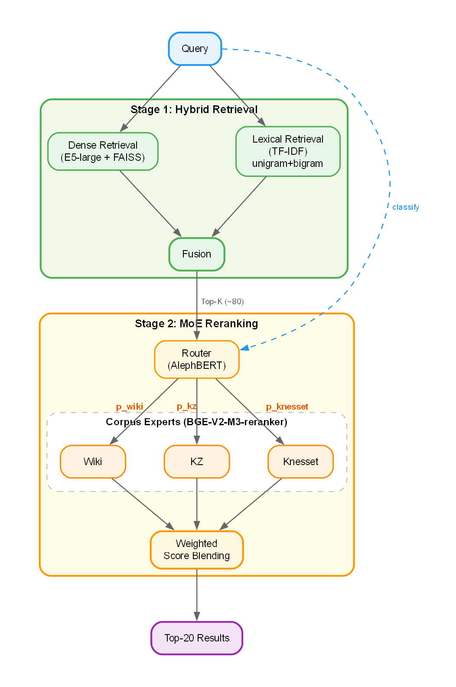
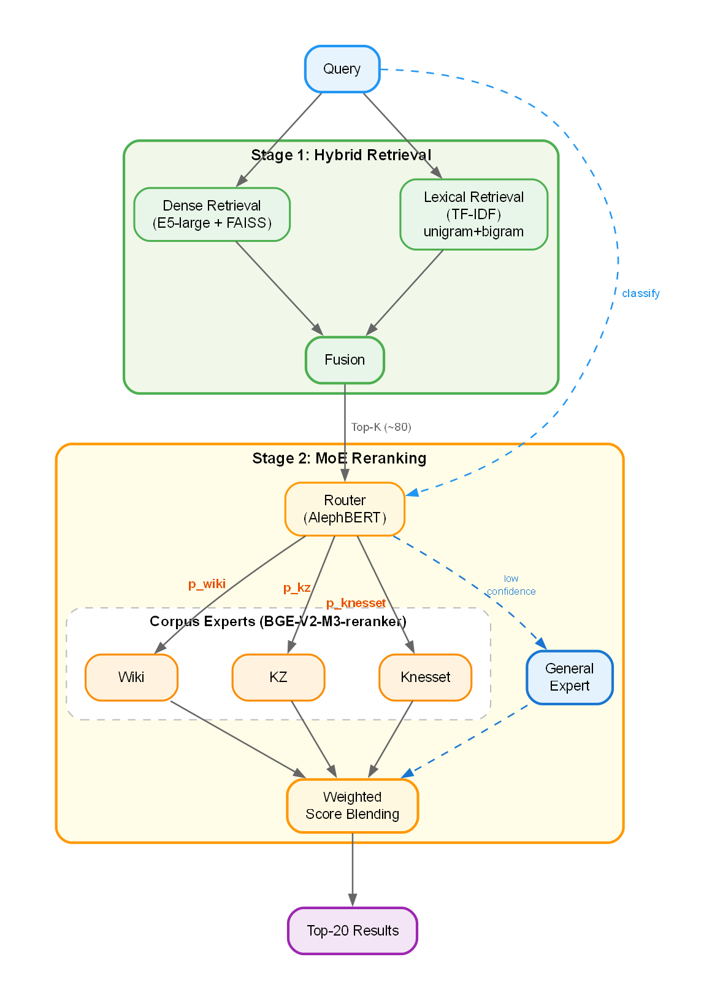

# MAFAT Hebrew Semantic Retrieval Challenge

## Introduction

This writeup documents my solution for the **MAFAT Hebrew Semantic Retrieval National Challenge**, organized by Israel's DDR&D in partnership with the Israel National NLP Program.

**Goal**: Given a natural language query in Hebrew, retrieve and rank the most relevant paragraphs from a large corpus spanning Wikipedia, Knesset protocols, and Kol-Zchut (legal/civic rights documentation).

---

## Table of Contents

1. [Task Definition](#task-definition) — Input/output format, data structure, evaluation metric
2. [Constraints](#constraints) — Hardware, runtime limits, submission format
3. [Why Hebrew Retrieval is Hard](#why-hebrew-retrieval-is-hard) — Morphology, ambiguity, domain challenges
4. [Solution Overview](#solution-overview) — Two-stage pipeline architecture
5. **Model 1: Two-Stage Retrieval with MoE Reranking**
   - [Part 1: Inference Pipeline](#part-1-inference-pipeline-submission) — Stage-1 retrieval, Stage-2 reranking, efficiency optimizations
   - [Part 2: Training](#part-2-training-offline) — Candidate construction, cross-encoder training, router training, data augmentation
6. **Model 2: Knowledge-Distilled Training**
   - [Overview](#overview) — Enhancements over Model 1
   - [Enhancement 1: Knowledge Distillation](#enhancement-1-knowledge-distillation) — Teacher pipeline, listwise KD loss
   - [Enhancement 2: Per-Corpus Rating Tables](#enhancement-2-per-corpus-rating-tables) — Custom gain mappings
   - [Enhancement 3: KZ-Specific Pretraining](#enhancement-3-kz-specific-pretraining) — Weak supervision pipeline
   - [Enhancement 4: Critical Passage Relabeling](#enhancement-4-critical-passage-relabeling) — LLM-assisted label cleaning
   - [Enhancement 5: General Cross-Encoder](#enhancement-5-general-cross-encoder-for-low-confidence-routing) — Low-confidence fallback
7. [Observations & Experiments](#observations--experiments) — Empirical findings that guided design choices

---

## Task Definition

**Input**: Hebrew query string

**Output**: Ranked list of scored paragraphs, sorted by relevance:
```python
[
    {"paragraph_uuid": "abc123", "score": 0.95},
    {"paragraph_uuid": "def456", "score": 0.82},
    ...
]
```

### Data Structure

**Corpus**: A dictionary mapping paragraph UUIDs to their content:
```python
{
    "uuid_1": {"passage": "Hebrew paragraph text..."},
    "uuid_2": {"passage": "Another paragraph..."},
    ...
}
```

**Training set**: Each query comes with its corpus class, a list of candidate paragraphs, and their human-annotated relevance labels.
```python
{
    "query_uuid": "q_123",
    "query": "Hebrew query string",
    "corpus": "wiki",  # one of: "wiki", "knesset", "kz"
    "paragraphs": {
        "paragraph_0": {"uuid": "p_1", ...},
        "paragraph_1": {"uuid": "p_2", ...},
        ...
    },
    "target_actions": {
        "target_action_0": 4,  # highly relevant
        "target_action_1": 2,  # partially relevant
        ...
    }
}
```

Labels range from 0 (not relevant) to 4 (highly relevant).

### Evaluation

**Metric**: NDCG@20 — rewards placing highly relevant documents at the top, with logarithmic discount at lower positions

**Final evaluation**: The organizers manually annotated a sample of newly retrieved paragraphs not in the original labeled pool, rewarding systems that surface relevant content beyond pre-annotated candidates.

---

## Constraints

**Format**: Code submission on Codabench — submit a ZIP (≤ 7GB) with all code, weights, and dependencies. Must run **offline** (no external APIs).

**Hardware**: Single g5.xlarge GPU

**Submission interface**: Submissions must implement two functions:
```python
def preprocess(corpus_dict):
    """One-time preprocessing. Returns data needed for retrieval."""
    ...

def predict(query_dict, preprocessed_data):
    """Per-query inference. Returns ranked list of scored paragraphs."""
    ...
```

`preprocess()` runs once per submission; `predict()` is called repeatedly for each query.

**Runtime limits**:
| Function | Limit |
|----------|-------|
| `preprocess(corpus)` | ≤ 1.5 hours |
| `predict(query)` | ≤ 2.0 sec/query |

---

## Why Hebrew Retrieval is Hard

**1. Rich Morphology** — Prefixes (ב, ה, ו, ל, מ) attach directly to words and combine freely. "ובבית" encodes "and in the house" as a single token. The same concept has many surface forms.

**2. Unvoweled Writing** — Hebrew omits vowels. The string "דבר" could mean "thing", "plague", or "speak" depending on context.

**3. Low-Resource** — Fewer annotated datasets and weaker multilingual model coverage compared to English.

**4. Heterogeneous Domains** — Wikipedia (encyclopedic), Knesset (parliamentary), and Kol-Zchut (legal) have vastly different vocabulary, style, and passage lengths.

**5. Long Passages** — Many paragraphs exceed typical 512-token length.

---

## Solution Overview

My approach uses a **two-stage retrieval pipeline**:

```
Query
  │
  ├─► Stage 1: Hybrid Retrieval ──► Top-K candidates (~80)
  │     ├─ Dense: E5 + FAISS
  │     └─ Lexical: TF-IDF
  │
  └─► Stage 2: MoE Reranking ──► Top-20 results
        ├─ Router: query → corpus probabilities
        └─ Experts: corpus-specific cross-encoders
```


- **Stage 1**: Fast candidate retrieval combining dense (E5) and lexical (TF-IDF) signals
- **Stage 2**: Cross-encoder reranking with corpus-specialized experts, routed by query type

The following sections detail each stage.

---

# Model 1: Two-Stage Retrieval with MoE Reranking

## Architecture Overview




---

# Part 1: Inference Pipeline (Submission)

This section describes what runs during Codabench evaluation.

---

## Stage 1: Hybrid Candidate Retrieval

Stage 1 retrieves a broad candidate set quickly, prioritizing **recall**.

### Dense Retrieval (E5)

- **Model**: Multilingual E5-large encoder
- **Input**: Text string (query or passage)
- **Output**: 1024-dim embedding vector (L2 normalized)
- **Encoding convention**: Queries use `"query: ..."` prefix, passages use `"passage: ..."`
- **Index**: FAISS `IndexFlatIP` — fast exact inner-product search (GPU accelerated if available)

### Lexical Retrieval (TF-IDF)

- **Model**: TF-IDF vectorizer (unigrams + bigrams)
- **Input**: Text string
- **Output**: Sparse vector of term weights
- **Purpose**: Captures exact matches, rare terms, and abbreviations that dense models may miss

### Fusion

- **Input**: Two ranked lists (dense scores, lexical scores)
- **Output**: Top-K candidate UUIDs (K ≈ 80)
- **Method**: Allocation-based fusion with deduplication:
  ```
  1. Take top-(K × w_dense) from dense, top-(K × w_lexical) from lexical
  2. For documents in both lists, keep max(dense_score, lexical_score)
  3. Sort by fused score, return top-K
  ```
  Default allocation ratios: `w_dense = 0.6`, `w_lexical = 0.4`

  After deduplication, each candidate keeps its best retrieval score (from either source) as the Stage-1 sort key. Because we re-sort after union, the final Top-K composition is not guaranteed to be exactly 60/40.

---

## Stage 2: Mixture-of-Experts Reranking

Stage 2 reranks candidates with high precision, using corpus-specialized models.

### Router

- **Model**: Fine-tuned AlephBERT-base
- **Input**: Query text
- **Output**: Probability distribution over `{wiki, kz, knesset}`

### Corpus-Specific Experts

Three cross-encoder rerankers, one per corpus:

- **Model**: Fine-tuned BGE-reranker-v2-m3
- **Input**: `(query, passage)` pair as single concatenated sequence
- **Output**: Scalar relevance score

Each expert uses corpus-appropriate max sequence length:

| Expert | Max Length |
|--------|------------|
| Wiki | 360 |
| KZ | 448 |
| Knesset | 496 |

Pairs are truncated to the expert's max length, prioritizing keeping the full query and truncating the passage from the end.

### Routing Logic

- **Input**: Router probabilities `p = [p_wiki, p_kz, p_knesset]` + expert scores
- **Output**: Top-20 results as `[{"paragraph_uuid": "...", "score": ...}, ...]`

Expert selection based on router confidence:

| Confidence | Condition | Strategy |
|------------|-----------|----------|
| High | max(p) ≥ 0.977 | Single top expert |
| Medium | 0.45 ≤ max(p) < 0.977 | Blend top-2 experts |
| Low | max(p) < 0.45 | Blend all 3 experts |

Final score computation:
```
score(doc) = Σ_{c ∈ selected} w_c × expert_c.score(query, doc)
where w_c = p_c / Σ_{j ∈ selected} p_j   (and w=1.0 in single-expert mode)
```
When mixing experts (top-2 or all-3), router probabilities are renormalized to sum to 1 over the selected experts.

---

## Efficiency Optimizations

To meet the 2 sec/query constraint:

| Optimization | Benefit |
|--------------|---------|
| Precompute E5 embeddings | Avoid re-encoding corpus |
| FAISS IndexFlatIP | Fast exact inner-product search |
| Pretokenize passages into token IDs | At inference tokenize only the query and assemble padded (query, passage) pairs |
| Batch reranking | Process all candidates together |
| Warmup pass | Eliminate first-query JIT overhead |
| FP16 model weights | E5: 2GB → 1GB, BGE: 2GB → 1GB |
| SDPA attention | Optimized scaled dot-product attention |

### preprocess() vs predict()

**preprocess()** (one-time, ≤1.5 hours):
- Embed corpus with E5, build FAISS index
- Fit TF-IDF vectorizer
- Load router + expert models
- Pretokenize all documents for cross-encoders

**predict()** (per-query, ≤2 sec):
- Encode query with E5
- Retrieve candidates (FAISS + TF-IDF fusion)
- Route query, score with selected expert(s)
- Return top-20

---

# Part 2: Training (Offline)

This section describes offline training — not part of the submission runtime.

---

## Training Data: Building Query-Candidate Groups

Cross-encoders are trained on **query-candidate groups** — for each query, we retrieve a fixed set of candidate passages and train the model to rank them correctly.

### Why Build Groups?

Unlike bi-encoders that learn from (query, positive, negative) triplets, cross-encoders score each (query, passage) pair independently. Training requires:
1. A query
2. A set of candidate passages (K ≈ 70)
3. Relevance labels for each candidate (0-4)

The model learns to assign higher scores to passages with higher labels within each group.

### Retrieval Pipeline

For each training query, we retrieve top-K candidates using 3-way RRF fusion:

| Retriever | Model/Config | Purpose |
|-----------|--------------|---------|
| **E5** | intfloat/multilingual-e5-large | Dense semantic retrieval |
| **TF-IDF (word)** | 1-2 grams, 300K features | Lexical exact matching |
| **TF-IDF (char)** | 3-4 char n-grams, 200K features, char_wb analyzer | Handles Hebrew morphology variants |

**Reciprocal Rank Fusion (RRF)**:
```
score(doc) = Σ weight[i] / (k + rank[i])
```

| Parameter | Value |
|-----------|-------|
| E5 weight | 0.6 |
| TF-IDF (word) weight | 0.4 |
| TF-IDF (char) weight | 0.15 |
| RRF k (stabilizer) | 60 |
| Pool size per source | max(K × 3, 150) |
| Final K | 70 candidates per query |

### Group Structure

Each group is saved as:
```json
{
  "query": "מתי נוסדה תל אביב?",
  "texts": ["passage_1", "passage_2", ...],  // K passages
  "labels": [4, 2, 0, 0, ...],               // relevance labels
  "case_name": "mafat_retrieval_wikipedia_corpus"
}
```

**Hard negatives**: Candidates retrieved by E5/TF-IDF but labeled 0 are hard negatives — they're lexically or semantically similar to the query but not relevant. These are more informative than random negatives.

### Train/Val Split

Queries are split 85/15 into train/val sets (stratified by corpus), producing separate group files for training and evaluation.

---

## Cross-Encoder Training

The cross-encoder experts are trained on the query-candidate groups. Each corpus expert is trained independently on groups from its corpus:

**Loss function**: ListNet (listwise ranking loss)
```
gain = 2^label - 1
target_prob = gain / sum(gains)
model_prob = softmax(scores / temperature)
loss = cross_entropy(target_prob, model_prob)
```

**Why ListNet (listwise) vs pairwise**: Training examples are query-level candidate lists with graded labels (0–4). ListNet converts gains (2^label - 1) into a target distribution over the whole list, so the model learns to concentrate probability on the best items without relying on pair sampling/margins. This tends to track NDCG@20 better than sampled pairwise losses in this setup.

**Unlabeled/label-0 behavior**: Label-0 items have zero target mass, so they aren't penalized directly — they're only pushed down if the model assigns them high probability (i.e., they steal mass from positives). This is less brittle when some 0s are actually unlabeled-but-relevant.

**Optimization**:
- Optimizer: AdamW with weight decay
- Schedule: Polynomial decay with 10% warmup
- Epochs: 2-4 per corpus
- Precision: FP16 mixed precision

**Checkpoint selection**: Best validation NDCG@20

---

## Router Training

The router is a query classifier that predicts which corpus a query belongs to.

### Model & Task

- **Model**: AlephBERT-base (`onlplab/alephbert-base`) — strong Hebrew encoder
- **Task**: 3-way classification → `{wiki, kz, knesset}`
- **Labels**: Uses `case_name` field from training data (corpus origin)
- **Input**: Query text only (no passages)
- **Output**: Probability distribution over 3 corpora

### Training Data

| Corpus | Queries | Percentage |
|--------|---------|------------|
| Wiki | 754 | 37% |
| KZ | 804 | 40% |
| Knesset | 476 | 23% |
| **Total** | **2,034** | 100% |

Split: 70% train (1,423) / 30% validation (611), stratified by corpus.

### Training Configuration

| Setting | Value |
|---------|-------|
| Max sequence length | 128 tokens |
| Batch size (train/eval) | 32 / 64 |
| Learning rate | 2e-5 |
| Scheduler | Linear warmup (5%) + decay |
| Epochs | 5 (early stopping, patience=2) |
| Label smoothing | 0.05 |
| Class weighting | Inverse frequency (α=0.15) |

### Performance

| Metric | Value |
|--------|-------|
| **Macro F1** | 97.6% |
| **Accuracy** | 97.9% |

**Per-class results**:

| Corpus | Precision | Recall | F1 |
|--------|-----------|--------|-----|
| Wiki | 100.0% | 98.7% | 99.3% |
| KZ | 98.3% | 97.5% | 97.9% |
| Knesset | 93.9% | 97.2% | 95.5% |

**Confusion patterns**: Minor confusion between Knesset ↔ KZ (both legal/governmental domains), but Wiki is nearly perfectly separated.

### Why AlephBERT

- Pre-trained on Hebrew Wikipedia + OSCAR Hebrew corpus
- Understands Hebrew morphology and domain vocabulary
- Compact (110M params) — fast inference for routing decisions

---

## Data Augmentation: Zero-Positive Query Relabeling

**Problem**: Many training queries have all candidates labeled 0 (no positives). These provide no useful signal for listwise ranking losses.

**Solution**: LLM-assisted relabeling pipeline to recover supervision.

**Pipeline**:
1. **Identify** zero-positive queries (all 20 candidates labeled 0)
2. **Retrieve** new candidates from full corpus using E5 + TF-IDF + cross-encoder reranking
3. **Find similar queries** from positive-labeled set using E5 embeddings
4. **Build calibration examples** showing label scale (0-4) from similar queries
5. **First-pass LLM labeling**: Assign labels 0-4 guided by calibration examples
6. **Second-pass LLM refinement**: Stricter pass to improve precision (prefer lower label when uncertain)
7. **Merge** pseudo-labels back into training set

**Label scale for LLM**:
| Label | Meaning |
|-------|---------|
| 0 | Not relevant |
| 1 | Weakly related, not useful as answer |
| 2 | Partial answer |
| 3 | Strong answer (minor details missing) |
| 4 | Complete answer |

**Example zero-positive queries** (all original candidates labeled 0):
- "מתי נוסדה חיפה?" (When was Haifa founded?)
- "מי היה ראש העיר הראשון של באר שבע?" (Who was the first mayor of Be'er Sheva?)
- "באיזו שנה הוקם הטכניון?" (In what year was the Technion established?)

**Sample first-pass prompt**:
```
You are a Hebrew relevance judge. Study the calibration examples to understand
how labels 0-4 are applied, then label the target passages.

## Calibration Examples (from similar queries)

Query: "מה השנה שבה נוסדה תל אביב?"
- Label 4: "תל אביב נוסדה בשנת 1909 על ידי..."
- Label 2: "תל אביב היא עיר מרכזית בישראל..."
- Label 0: "ירושלים היא בירת ישראל..."

## Target Query
Query: "מתי נוסדה חיפה?"

## Passages to Label
1. "<passage 1 text>"
2. "<passage 2 text>"
...

Output JSON only: {"labels": [4, 2, 0, ...]}
```

**Sample second-pass prompt** (stricter):
```
Re-evaluate these passages with stricter criteria. For factoid queries,
label 4 requires the exact answer string AND the correct relation.
When uncertain between two labels, choose the lower one.

Query: "<query>"
Passages with preliminary labels:
1. "<passage>" (preliminary: 3)
2. "<passage>" (preliminary: 2)
...

Output JSON only: {"labels": [2, 1, ...]}
```

**Result**: Previously "dead" queries now contribute useful listwise supervision.

---

## Code Files

| Component | File | Description |
|-----------|------|-------------|
| **Inference Pipeline** | `model1/model.py` | Full inference code (preprocess + predict) |
| **Cross-Encoder Training** | `model1/training.ipynb` | Expert training with ListNet loss |
| **Router Training** | `common/classifier_query.ipynb` | AlephBERT query classifier |
| **Zero-Positive Relabeling** | `common/relabel_zero_positives.ipynb` | LLM-assisted relabeling pipeline |

---

# Model 2: Knowledge-Distilled Training

## Overview

Model 2 uses the **same inference pipeline** as Model 1, with one addition: a **General Expert** for low-confidence routing fallback.



The difference is in **how the cross-encoder experts are trained**. Model 2 adds five enhancements:

1. **Knowledge distillation** from an external teacher system
2. **Per-corpus rating tables** instead of generic gain mapping
3. **KZ-specific pretraining** for better initialization
4. **Critical passage relabeling** to reduce label noise
5. **General cross-encoder** for low-confidence routing fallback

---

## Enhancement 1: Knowledge Distillation

### Teacher Pipeline Overview

The teacher system is a multi-stage retrieval pipeline that produces soft labels for training:

```
Corpus + Queries
      ↓
┌─────────────────────────────────┐
│  Stage 1: Candidate Building    │
│  (4-way RRF fusion)             │
└─────────────────────────────────┘
      ↓
┌─────────────────────────────────┐
│  Stage 2: Voyage Reranking      │
│  (Cross-encoder teacher scores) │
└─────────────────────────────────┘
      ↓
┌─────────────────────────────────┐
│  Stage 3: Multi-Reranker Fusion │
│  (Optional: 3-way RRF)          │
└─────────────────────────────────┘
      ↓
  Teacher Scores for KD
```

### Stage 1: Candidate Building (4-Way RRF)

For each query, we retrieve candidates from four sources and fuse them:

| Retriever | Model | Purpose |
|-----------|-------|---------|
| **Voyage** | voyage-3.5 | State-of-the-art multilingual embeddings |
| **E5** | intfloat/multilingual-e5-large | Strong open-source alternative |
| **TF-IDF Word** | 1-2 gram, 300K features | Lexical exact matching |
| **TF-IDF Char** | 3-4 char n-grams, 200K features | Handles Hebrew morphology |

**Reciprocal Rank Fusion (RRF)**:
```
score(doc) = Σ weight[i] / (k + rank[i])
```

Default weights: Voyage=0.30, E5=0.30, TF-IDF_word=0.25, TF-IDF_char=0.15

**Why 4-way fusion**: Different retrievers have complementary strengths:
- Neural embeddings capture semantic similarity
- TF-IDF catches exact term matches neural models may miss
- Character n-grams help with Hebrew's complex morphology

### Stage 2: Voyage Reranking

The fused candidates are reranked using Voyage's cross-encoder:

| Setting | Value |
|---------|-------|
| Model | rerank-2.5 |
| Input | Top-K candidates per query (K=100 for KZ/Knesset, K=50 for Wiki) |
| Output | Relevance scores (0-1) for each (query, doc) pair |


### Stage 3: Multi-Reranker Fusion (Optional)

For additional robustness, we can fuse multiple reranker outputs:

| Reranker | Model | Notes |
|----------|-------|-------|
| **Voyage** | rerank-2.5 | API-based, highest quality |
| **BGE m3** | BAAI/bge-reranker-v2-m3 | Local cross-encoder |
| **BGE Gemma2** | BAAI/bge-reranker-v2.5-gemma2-lightweight | LLM-based reranker |

**3-Way RRF Fusion**:
- Voyage weight: 0.50
- BGE m3 weight: 0.25
- BGE Gemma2 weight: 0.25

This produces more stable rankings than any single reranker.

### Teacher Score Output

The final output is a JSONL file per corpus:
```json
{
  "query_uuid": "abc123",
  "query": "מה זכויותיי כשכיר?",
  "results": [
    {"doc_id": "doc1", "score": 0.92, "rank": 1},
    {"doc_id": "doc2", "score": 0.87, "rank": 2},
    ...
  ]
}
```

### Listwise KD Loss

For each query, we create a teacher distribution over documents and train the student to mimic it:

```
teacher_dist = softmax(teacher_scores / T_kd)
student_dist = softmax(student_scores / τ)
L_kd = KL_divergence(teacher_dist, student_dist)
```

| Parameter | Description |
|-----------|-------------|
| `T_kd` | Teacher temperature (softens distribution) |
| `τ` | Student temperature |
| Excluded | Documents without teacher scores |

**Why it helps**:
- Teacher provides fine-grained ranking signal beyond coarse 0-4 labels
- Multiple retrievers + rerankers reduce noise from any single model
- Soft labels capture relative ordering, not just binary relevance

---

## Enhancement 2: Per-Corpus Rating Tables

### Problem with Generic Gains

The standard DCG gain mapping `g = 2^label - 1` treats all corpora equally:

| Label | Generic Gain |
|-------|--------------|
| 0 | 0 |
| 1 | 1 |
| 2 | 3 |
| 3 | 7 |
| 4 | 15 |

But corpora have different label distributions — a "4" in Knesset (sparse positives) should contribute differently than a "4" in Wikipedia.

### Label Distribution Analysis

First, we analyze label frequencies per corpus:

| Corpus | Label 0 | Label 1 | Label 2 | Label 3 | Label 4 |
|--------|---------|---------|---------|---------|---------|
| Wiki | 55,231 | 1,311 | 620 | 498 | 1,540 |
| KZ | 57,476 | 3,739 | 1,214 | 540 | 631 |
| Knesset | 33,255 | 1,190 | 741 | 403 | 571 |

Key observations:
- **Wiki**: Many label-4 (strong positives), fewer mid-range
- **KZ**: More label-1 (weak positives), balanced distribution
- **Knesset**: Sparse positives overall, challenging retrieval

### r_table Formula

We derive custom gain tables using a parameterized formula:

```
r[label] = (base_gain[label] + δ)^α × weight[label]
```

Where:
- `base_gain = [0, 1, 3, 7, 15]` (standard 2^label - 1)
- `δ` = shift parameter (smooths low labels)
- `α` = exponent (controls sharpness)
- `weight` = derived from inverse label frequency

**Weight derivation**:
```
weight[label] = (frequency[label] + ε)^(-β)
```
Then enforced monotone non-decreasing and normalized.

### Grid Search (No Training Required)

We optimize r_table parameters using only label statistics:

**Per-Corpus Search Grids**:

| Corpus | α range | δ values | β values | Target Perplexity |
|--------|---------|----------|----------|-------------------|
| Wiki | 0.90 - 1.20 | 0.00, 0.05, 0.10 | 0.00, 0.25, 0.50 | 3.0 |
| KZ | 0.70 - 1.00 | 0.10, 0.20, 0.30 | 0.00, 0.25, 0.50 | 4.2 |
| Knesset | 1.20 - 1.70 | 0.00, 0.05, 0.10 | 0.25, 0.50, 0.75 | 3.5 |

**Objective Function**:
```
loss = w_P × (perplexity - target)² - w_4 × p4_mass - w_3 × p3_mass
```

- `perplexity`: Effective number of positive labels (exp of entropy)
- `p4_mass`, `p3_mass`: Probability mass on high labels
- Lower loss is better (match perplexity + reward high-label focus)

### Derived r_tables

The optimization produces corpus-specific gain mappings:

| Corpus | α | δ | β | r_table [0, 1, 2, 3, 4] |
|--------|---|---|---|-------------------------|
| **Wiki** | 1.20 | 0.10 | 0.25 | [0, 1.12, 5.20, 15.24, 37.70] |
| **KZ** | 0.95 | 0.30 | 0.50 | [0, 1.28, 6.26, 21.08, 42.58] |
| **Knesset** | 1.20 | 0.10 | 0.25 | [0, 1.12, 4.75, 16.29, 40.29] |

**Achieved Metrics**:

| Corpus | Target Perplexity | Achieved | p4 Mass | p3 Mass |
|--------|-------------------|----------|---------|---------|
| Wiki | 3.0 | 2.96 | 68.9% | 12.6% |
| KZ | 4.2 | 4.19 | 27.6% | 18.8% |
| Knesset | 3.5 | 3.44 | 38.9% | 18.5% |

### Why This Helps

- **Wiki**: Higher α (1.20) creates sharper distinction, focusing on the abundant label-4s
- **KZ**: Lower α (0.95) with higher δ (0.30) gives more weight to mid-range labels
- **Knesset**: Sharp α but tuned weights handle the sparse positive distribution

The r_tables are used in the ListNet loss during training, replacing the generic gain mapping

---

## Enhancement 3: KZ-Specific Pretraining

The Kol-Zchut expert receives better initialization through a weak supervision pipeline:

### Step 1: Select Promising Questions

Not all KZ questions are equally useful for training. We identify "interesting" questions where retrieval models disagree:

**Process**:
1. For each question, retrieve top-K candidates using:
   - **E5** (bi-encoder + FAISS)
   - **TF-IDF** (lexical matching)
   - **BGE reranker** (cross-encoder)

2. Score questions by model disagreement:
   ```
   score = w1 × (1 - jaccard(E5, CE)) +
           w2 × (1 - jaccard(E5, TF-IDF)) +
           w3 × (1 - jaccard(CE, TF-IDF)) +
           w4 × ce_ambiguity +
           w5 × union_size_norm
   ```

3. Select top-N questions with highest disagreement scores

**Intuition**: Questions where models disagree are harder examples that benefit most from additional training signal.

### Step 2: Build Pretrain Groups

Create training pairs using weak supervision:

**Positives**: CSV paragraph answers (label=3)
- These are known good answers from KZ knowledge base
- Capped at MAX_POS_PER_Q (default: 4) per question

**Negatives**: Retrieved candidates from corpus (label=0)
- RRF fusion of E5 + TF-IDF + CE candidate lists
- Filtered to only include passages present in competition corpus
- These are unlabeled but ranked highly by at least one retriever

**Group structure**:
```
{
  "query": "question text",
  "texts": [pos1, pos2, neg1, neg2, ...],  # K items total
  "labels": [3, 3, 0, 0, ...]
}
```

### Step 3: Pretrain Cross-Encoder

Fine-tune BGE reranker on the generated groups:

| Setting | Value |
|---------|-------|
| Base model | BAAI/bge-reranker-v2-m3 |
| Loss | ListNet (listwise ranking) |
| Epochs | 2 |
| Learning rate | 8e-6 |
| Max length | 448 |
| Evaluation | NDCG@20 on validation split |

**Why this helps**:
- The KZ expert sees domain-specific terminology before competition fine-tuning
- Weak labels from CSV answers provide signal beyond just the competition training set
- Model disagreement sampling focuses on hard examples

---

## Enhancement 4: Critical Passage Relabeling

### The Problem: Unlabeled Passages Blocking Good Results

The competition training data has sparse labels — only a subset of passages per query are labeled. When our models rank an **unlabeled** passage above a **labeled positive** (≥3 or ≥4), we face a dilemma:

- If the unlabeled passage is actually relevant → training penalizes correct behavior
- If the unlabeled passage is irrelevant → model learns from noisy signal

### Detection Strategy

We identify "critical" unlabeled passages using the fused reranker outputs:

**CRIT_GE3**: Unlabeled passages ranked above the first label≥3
```
For each query:
  1. Get fused ranking from Voyage + BGE m3 + BGE Gemma2
  2. Find position of first passage with label ≥ 3
  3. Flag all unlabeled passages ranked higher
```

**CRIT_GE4**: Same logic, but for label≥4 threshold

**Additional criteria**:
- **ZERO_POS**: Queries with no positive labels → top-K unlabeled candidates
- **CONS_TOPK**: Unlabeled passages in top-K of multiple rerankers (consensus)

### Relabeling Pipeline

Critical passages are sent to an LLM for human-quality labeling:

```
┌─────────────────────────────────┐
│  Detect Critical Passages       │
│  (CRIT_GE3, CRIT_GE4, etc.)    │
└─────────────────────────────────┘
              ↓
┌─────────────────────────────────┐
│  LLM Relabeling                 │
│  (GPT-4 / Claude with rubric)   │
└─────────────────────────────────┘
              ↓
┌─────────────────────────────────┐
│  Merge into Training Labels     │
│  (Replace None → 0-4)           │
└─────────────────────────────────┘
```

### Statistics

| Criterion | Wiki | KZ | Knesset | Total |
|-----------|------|-----|---------|-------|
| CRIT_GE3 | ~200 | ~350 | ~180 | ~730 |
| CRIT_GE4 | ~150 | ~280 | ~140 | ~570 |
| ZERO_POS | ~80 | ~120 | ~60 | ~260 |
| CONS_TOPK | ~300 | ~400 | ~250 | ~950 |

### Why This Helps

- **Reduces label noise**: Critical unlabeled passages get proper labels instead of implicit 0
- **Improves training signal**: Model learns correct ranking without penalty for surfacing good results
- **Targets high-impact cases**: Focuses labeling effort where it matters most for NDCG

---

## Enhancement 5: General Cross-Encoder for Low-Confidence Routing

### The Problem: Uncertain Corpus Assignment

Model 1 uses a router to assign queries to corpus-specific experts. When the router is confident, a single expert handles reranking. When uncertain, it blends two corpus experts.

But what if the query doesn't clearly belong to any corpus? Blending two potentially wrong experts may not help.

### Solution: Train a General Expert

We train an additional cross-encoder on **all corpora combined**:

| Setting | Value |
|---------|-------|
| Training data | Union of Wiki + KZ + Knesset |
| Base model | BAAI/bge-reranker-v2-m3 |
| Loss | ListNet (listwise ranking) |
| Corpus tokens | `<CORP:WIKIPEDIA>`, `<CORP:KZ>`, `<CORP:KNESSET>` prepended to queries |
| Purpose | Fallback for ambiguous queries |

**Corpus token approach**: Instead of sampling-based weighting, we prepend special corpus tokens to queries (e.g., `<CORP:WIKIPEDIA> {query}`). This allows the model to learn corpus-specific patterns while sharing parameters across all data.

### Modified Routing Logic

```
router_confidence = max(softmax(router_logits))

if router_confidence >= θ_high:
    # High confidence → single corpus expert
    score = expert[predicted_corpus](query, doc)

elif router_confidence >= θ_low:
    # Medium confidence → corpus expert + general expert
    score = α × expert[predicted_corpus](query, doc) +
            (1-α) × general_expert(query, doc)

else:
    # Low confidence → general expert only
    score = general_expert(query, doc)
```

| Threshold | Model 1 Behavior | Model 2 Behavior |
|-----------|------------------|------------------|
| High (≥θ_high) | 1 corpus expert | 1 corpus expert |
| Medium | Blend 2 corpus experts | 1 corpus + general |
| Low (<θ_low) | Blend 2 corpus experts | General only |

### Why This Helps

- **Better fallback**: General expert trained on all data handles cross-corpus queries
- **Reduced confusion**: Avoids blending experts from wrong corpora
- **Robustness**: Queries that don't fit any corpus pattern still get reasonable ranking

---

## Combined Training Objective

Each corpus expert is trained with a weighted combination:

```
L_total = α × L_supervised + β × L_kd
```

### Per-Corpus Weights

| Corpus | α (supervised) | β (KD) | Rationale |
|--------|----------------|--------|-----------|
| Wiki | 0.65 | 0.50 | Strong labels + teacher |
| KZ | 0.70 | 0.20 | Rely more on labels |
| Knesset | 0.80 | 0.10 | Most challenging, heavily supervised |

### Other Per-Corpus Settings

- Student temperature τ
- Teacher temperature T_kd
- Max sequence length
- Number of epochs

---

## Summary: Model 1 vs Model 2

| Aspect | Model 1 | Model 2 |
|--------|---------|---------|
| Inference | Two-stage + MoE | Same |
| Supervised loss | ListNet | ListNet |
| Gain mapping | Generic (2^r - 1) | Per-corpus r_table |
| KD from teacher | No | Yes (Voyage + RRF) |
| KZ initialization | BGE base | Pretrained checkpoint |
| Label curation | Original labels only | + LLM relabeled critical passages |
| Low-confidence routing | Blend 2 corpus experts | Corpus expert + general expert |

Model 2's training improvements target better alignment with NDCG while leveraging external ranking knowledge, cleaner training labels, and more robust routing fallback.

---

## Code Files

| Component | File | Description |
|-----------|------|-------------|
| **Inference Pipeline** | `model2/model.py` | model2 inference |
| **KD Teacher Pipeline** | `model2/kd_pipeline_final.ipynb` | 4-way retrieval + Voyage reranking + RRF fusion |
| **Per-Corpus r_table** | `model2/r_table.ipynb` | Rating table optimization (grid search) |
| **KZ Pretraining** | `model2/kz_missing.ipynb` | Weak supervision for KZ expert |
| **Critical Relabeling** | `model2/crit_relabel_pipeline.ipynb` | LLM relabeling with GPT-5 + Gemini |
| **General Expert** | `model2/general_ce.ipynb` | Cross-corpus fallback training |
| **Expert Training** | `model2/training.ipynb` | KD + supervised training with r_tables |
| **Router Training** | `common/classifier_query.ipynb` | AlephBERT query classifier (shared) |
| **Zero-Positive Relabeling** | `common/relabel_zero_positives.ipynb` | LLM-assisted relabeling (shared) |

---

# Observations & Experiments

This section documents key findings from offline experiments on the training data that informed the final solution design.

---

## Embedding Model Selection

We evaluated several embedding models on Stage-1 retrieval (dense only, no TF-IDF):

| Model | Recall@50 | nDCG@50 |
|-------|-----------|---------|
| **E5-large** | 0.707 | 0.672 |
| BGE-M3 | 0.662 | 0.671 |
| GTE | 0.559 | 0.579 |
| Jina-v3 | 0.549 | — |
| QWEN | 0.515 | 0.544 |

**Per-corpus breakdown** (E5 Recall@50):

| Corpus | Recall@50 | Difficulty |
|--------|-----------|------------|
| Wikipedia | 0.816 | Easiest |
| KZ | 0.709 | Medium |
| Knesset | 0.546 | Hardest |

**Takeaway**: E5-large consistently outperformed alternatives. Knesset's parliamentary language proved most challenging — all embedders struggled with its specialized terminology.

---

## Embeddings: Good for Recall, Not Ranking

Raw embedding similarity correlates only weakly with graded relevance (Pearson r ≈ 0.13). This motivated treating dense retrieval as a high-recall filter and relying on cross-encoders for precision.

On the fused Stage-1 ranking, NDCG@20 was ~0.48. With perfect reordering of the same top-20 candidates, the upper bound is ~0.72. This ~0.24 gap confirmed the need for a strong reranker.

---

## Hybrid Retrieval Gains

Adding TF-IDF to E5 significantly improves recall, especially for Knesset:

| Retriever | Overall Recall@80 | Knesset Recall@80 |
|-----------|-------------------|-------------------|
| E5 only | 0.817 | 0.718 |
| TF-IDF only | 0.551 | 0.416 |
| **E5 + TF-IDF (RRF)** | **0.863** | **0.758** |

**Source attribution** (what each retriever uniquely contributes at K=100):

| Source | Marginal Recall Gain |
|--------|---------------------|
| E5 baseline | — |
| +TF-IDF (word) | +7.5% |
| +TF-IDF (char) | +1.4% |

The Jaccard overlap between E5 and TF-IDF results is only ~12%, confirming they retrieve complementary documents. Lexical signals add minimal recall in Wikipedia (dense already captures most positives) but are valuable in Knesset where exact term matching helps with specialized vocabulary.

---

## Why ~80 Stage-1 Candidates

Recall improves quickly with K but shows diminishing returns beyond ~80:

| K | Recall | UB-NDCG@20 |
|---|--------|------------|
| 20 | 0.64 | 0.72 |
| 50 | 0.81 | 0.83 |
| **80** | **0.87** | **0.87** |
| 100 | 0.89 | 0.89 |
| 150 | 0.92 | 0.90 |

We picked K≈80 as a practical trade-off between recall headroom and reranking compute under the 2 sec/query constraint.

**Per-corpus saturation** differs:

| Corpus | Recommended K | UB-NDCG@20 |
|--------|---------------|------------|
| Wikipedia | 100 | 0.92 |
| KZ | 200 | 0.97 |
| Knesset | 200 | 0.81 |

Knesset's lower ceiling even at K=200 reflects inherent difficulty.

---

## Reranker Impact

Cross-encoder reranking provides substantial gains over Stage-1:

| Configuration | NDCG@20 | Delta |
|---------------|---------|-------|
| Stage-1 only (E5+TF-IDF) | 0.46 | — |
| + BGE reranker (no fine-tune) | 0.56 | +0.10 |
| + BGE reranker (fine-tuned) | **0.66** | **+0.20** |
| + Gemma reranker (no fine-tune) | 0.57 | +0.11 |

Fine-tuning the cross-encoder doubles the reranking improvement.

**Per-corpus lift** (fine-tuned BGE):

| Corpus | Stage-1 | Reranked | Delta |
|--------|---------|----------|-------|
| Wikipedia | 0.59 | 0.67 | +0.08 |
| KZ | 0.48 | 0.54 | +0.06 |
| Knesset | 0.34 | 0.40 | +0.06 |

---

## Model Performance on Labeled Candidates

We evaluated models on the 20 pre-labeled candidates per query from the training set (reranking only, no retrieval). This isolates ranking quality from retrieval quality.

**Overall NDCG@20**:

| Model | Type | NDCG@20 |
|-------|------|---------|
| E5-large | Bi-encoder | 0.754 |
| BGE-M3 | Bi-encoder | 0.669 |
| GTE | Bi-encoder | 0.600 |
| GTE-CE | Cross-encoder | 0.738 |
| BGE-CE (v2-m3) | Cross-encoder | 0.786 |
| **Voyage rerank-2.5** | Cross-encoder (API) | **0.814** |

**Per-corpus breakdown** (NDCG@20):

| Corpus | E5 | BGE-M3 | BGE-CE | GTE-CE | Voyage |
|--------|-----|--------|--------|--------|--------|
| Wikipedia | 0.80 | 0.70 | 0.80 | 0.76 | **0.84** |
| KZ | 0.77 | 0.69 | 0.82 | 0.77 | **0.85** |
| Knesset | 0.64 | 0.59 | 0.69 | 0.66 | **0.73** |

**Observations**:
- Cross-encoders outperform bi-encoders for reranking (BGE-CE > E5 by +0.03)
- Voyage is the strongest reranker across all corpora
- Knesset remains the hardest corpus even with oracle candidates

---

## External Teacher Quality

Voyage rerank-2.5 (API) vs local cross-encoders on the 20-candidate train set:

| Corpus | BGE-CE | Voyage | Delta |
|--------|--------|--------|-------|
| Wikipedia | 0.80 | 0.84 | +0.04 |
| KZ | 0.82 | 0.85 | +0.03 |
| Knesset | 0.69 | 0.73 | +0.04 |

Voyage consistently outperforms local cross-encoders by 3-4%, justifying its use as the KD teacher in Model 2.

---

## Corpus-Specific Truncation

Token-length distributions vary significantly (BGE tokenizer):

| Corpus | Mean | Median | p90 | p95 | Max |
|--------|------|--------|-----|-----|-----|
| Wikipedia | 273 | 256 | 447 | 477 | 510 |
| KZ | 420 | 433 | 509 | 623 | 3283 |
| Knesset | 330 | 337 | 418 | 509 | 2239 |

Wikipedia passages are short; KZ and Knesset have heavy long tails (>1K tokens). This motivated corpus-specific max sequence lengths:

- **Wiki**: 360 (covers p90)
- **KZ**: 448 (covers median+)
- **Knesset**: 496 (covers p95)

---

## Experiments Not Used

### ColBERT Reranking

Tested ColBERT as an intermediate reranker between Stage-1 and cross-encoder:

| Stage-1 K | Base Recall@50 | +ColBERT | Delta |
|-----------|----------------|----------|-------|
| 50 | 0.80 | 0.84 | +0.04 |

ColBERT improved recall by ~4% but added latency. Given the 2 sec/query constraint and marginal gains, we opted for the simpler E5+TF-IDF fusion.

### BGE-M3 Hybrid Mode

BGE-M3's built-in hybrid (dense+sparse) mode underperformed separate E5+TF-IDF fusion on our data, possibly due to Hebrew tokenization differences in the sparse component.
